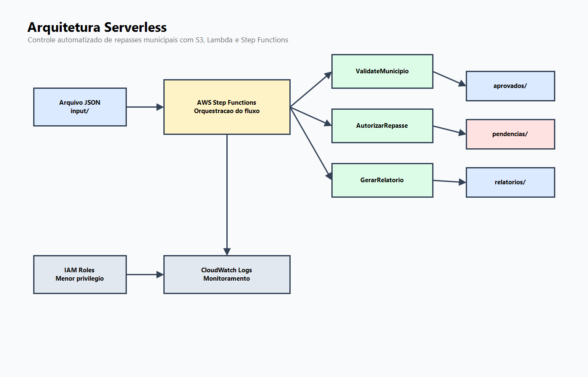
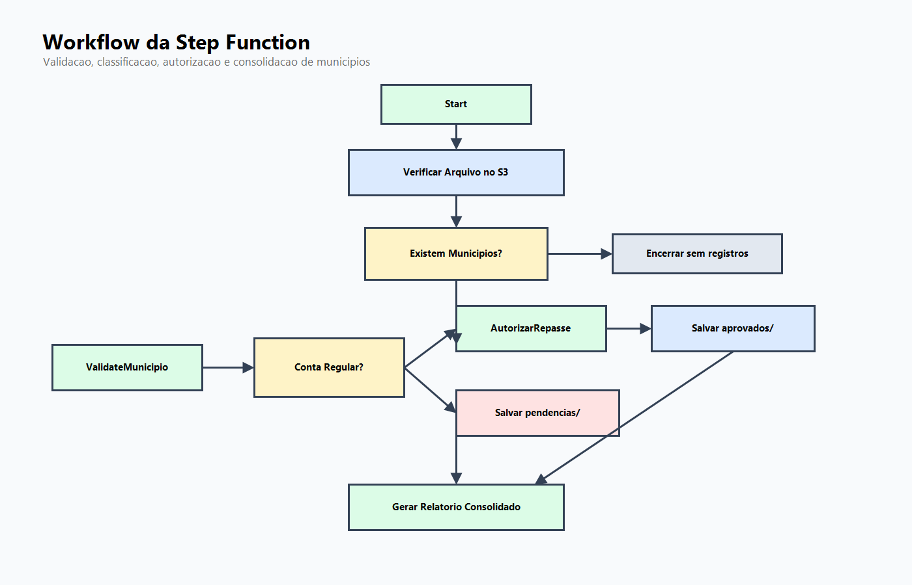

# AWS Step Functions - Controle Automatizado de Repasses aos Municipios

Projeto desenvolvido como parte da formacao AWS da DIO, no modulo **Explorando Workflows Automatizados com AWS Step Functions**.

A proposta simula uma solucao serverless para apoiar a analise de municipios aptos a receber repasses financeiros. O fluxo recebe um arquivo JSON no Amazon S3, valida os registros, classifica municipios com conta regular ou pendente, autoriza os repasses aprovados e gera um relatorio consolidado.

## Problema de Negocio

Em processos de transferencia de recursos publicos, equipes de execucao orcamentaria e financeira precisam acompanhar municipios, saldos, regularidade de contas e autorizacoes de pagamento. Quando esse controle e feito manualmente, ha maior risco de retrabalho, atraso na analise e dificuldade para rastrear decisoes.

Este projeto demonstra como um workflow automatizado pode organizar parte desse processo, mantendo cada etapa clara, rastreavel e separada por responsabilidade.

## Arquitetura



Servicos utilizados:

- **Amazon S3**: armazenamento dos arquivos de entrada, municipios aprovados, pendencias e relatorios.
- **AWS Step Functions**: orquestracao do processo de validacao, classificacao e consolidacao.
- **AWS Lambda**: execucao das regras de validacao, autorizacao simulada e geracao de relatorio.
- **IAM**: permissoes para acesso controlado entre Step Functions, Lambda e S3.
- **CloudWatch**: acompanhamento de logs e execucoes.

## Fluxo do Workflow



1. O arquivo `municipios.json` e enviado para `s3://municipios-repasse/input/`.
2. A Step Function le o arquivo no S3.
3. Um estado `Choice` verifica se existem municipios para processar.
4. Um estado `Map` percorre cada municipio individualmente.
5. A Lambda `ValidateMunicipio` valida campos obrigatorios e tipos de dados.
6. Um estado `Choice` verifica se a conta do municipio esta regular.
7. Municipios regulares passam pela Lambda `AutorizarRepasse`.
8. Registros aprovados sao salvos em `aprovados/`.
9. Registros pendentes ou invalidos sao salvos em `pendencias/`.
10. A Lambda `GerarRelatorio` consolida o resultado final.
11. O relatorio e salvo em `relatorios/`.

## Estrutura do Bucket

```text
municipios-repasse/
├── input/
├── aprovados/
├── pendencias/
└── relatorios/
```

## Estrutura do Repositorio

```text
aws-stepfunctions-municipal-fund-transfer/
├── README.md
├── diagrams/
│   ├── workflow.drawio
│   └── workflow.png
├── samples/
│   ├── municipios.json
│   ├── municipios-vazio.json
│   ├── relatorio-consolidado.json
│   └── relatorio-consolidado.TXT
├── images/
│   ├── architecture.png
│   ├── cloudwatch-autorizar-repasse-streams.png
│   ├── cloudwatch-gerar-relatorio-streams.png
│   ├── cloudwatch-log-groups.png
│   ├── cloudwatch-validate-municipio-streams.png
│   ├── execution-details.png
│   ├── execution-failure-pendencias.png
│   ├── execution-no-records.png
│   ├── execution-success.png
│   ├── lambda-autorizar-repasse-code.png
│   ├── lambda-functions.png
│   ├── lambda-gerar-relatorio-code.png
│   ├── lambda-validate-municipio-code.png
│   ├── s3-approved-objects.png
│   ├── s3-bucket-structure.png
│   ├── s3-input-objects.png
│   ├── s3-pending-objects.png
│   ├── s3-report-object.png
│   ├── s3-report-properties.png
│   ├── state-machine-executions.png
│   └── state-machine-overview.png
├── lambda/
│   ├── validate_municipio.py
│   ├── autorizar_repasse.py
│   └── gerar_relatorio.py
├── stepfunctions/
│   └── state_machine.asl.json
└── docs/
    ├── architecture.md
    ├── evidences.md
    └── lessons-learned.md

## Exemplo de Entrada

```json
[
  {
    "municipio": "Brasilia",
    "uf": "DF",
    "valor": 50000,
    "conta_regular": true
  },
  {
    "municipio": "Goiania",
    "uf": "GO",
    "valor": 25000,
    "conta_regular": false
  }
]
```

## Execucao Esperada

Entrada da Step Function:

```json
{
  "bucket": "municipios-repasse",
  "key": "input/municipios.json"
}
```

Evidencias de execucao:

- Execucao bem-sucedida: `images/execution-success.png`
- Execucao sem registros: `images/execution-no-records.png`
- Falha corrigida no fluxo de pendencias: `images/execution-failure-pendencias.png`
- Detalhes da execucao: `images/execution-details.png`
- Estrutura do bucket S3: `images/s3-bucket-structure.png`
- Arquivos de entrada: `images/s3-input-objects.png`
- Municipios aprovados no S3: `images/s3-approved-objects.png`
- Municipios pendentes no S3: `images/s3-pending-objects.png`
- Relatorio consolidado no S3: `images/s3-report-object.png`
- Execucoes da State Machine: `images/state-machine-executions.png`
- Funcoes Lambda criadas: `images/lambda-functions.png`
- Logs no CloudWatch: `images/cloudwatch-log-groups.png`

O relatorio consolidado gerado pela execucao tambem esta disponivel em:

- `samples/relatorio-consolidado.json`
- `samples/relatorio-consolidado.txt`

Saida consolidada esperada:

```json
{
  "municipios_processados": 5,
  "aprovados": 3,
  "pendentes": 2,
  "valor_total_autorizado": 170000
}
```

## Como Implantar Manualmente

1. Criar o bucket S3 `municipios-repasse`.
2. Criar as pastas `input/`, `aprovados/`, `pendencias/` e `relatorios/`.
3. Criar as tres funcoes Lambda usando os arquivos da pasta `lambda/`.
4. Criar uma role IAM para as Lambdas com permissao de escrita no CloudWatch Logs.
5. Criar uma role IAM para a Step Function com permissoes para invocar Lambda e acessar objetos no S3.
6. Criar a State Machine usando `stepfunctions/state_machine.asl.json`.
7. Substituir `REGION` e `ACCOUNT_ID` pelos valores da sua conta AWS.
8. Enviar `samples/municipios.json` para `s3://municipios-repasse/input/municipios.json`.
9. Executar a Step Function informando o bucket e a chave do arquivo.
10. Verificar os resultados nas pastas `aprovados/`, `pendencias/` e `relatorios/`.

## Beneficios Demonstrados

- Automatizacao de uma rotina comum em execucao financeira.
- Separacao clara entre validacao, decisao, autorizacao e relatorio.
- Rastreabilidade por execucao da Step Function.
- Uso de arquitetura serverless com baixo acoplamento.
- Base simples para evolucao futura com novos criterios de elegibilidade.

## Melhorias Futuras

- Acionar a Step Function automaticamente com EventBridge ou evento do S3.
- Adicionar validacoes de limite orcamentario por UF ou programa.
- Versionar relatorios com data e identificador da execucao.
- Implementar testes automatizados para as Lambdas.
- Evoluir para infraestrutura como codigo com Terraform.
- Criar pipeline de deploy com GitHub Actions.

## Resultado

Este projeto foi pensado para demonstrar fundamentos de Cloud Computing aplicados a um contexto real de negocio: execucao, controle e acompanhamento de repasses financeiros a municipios.
